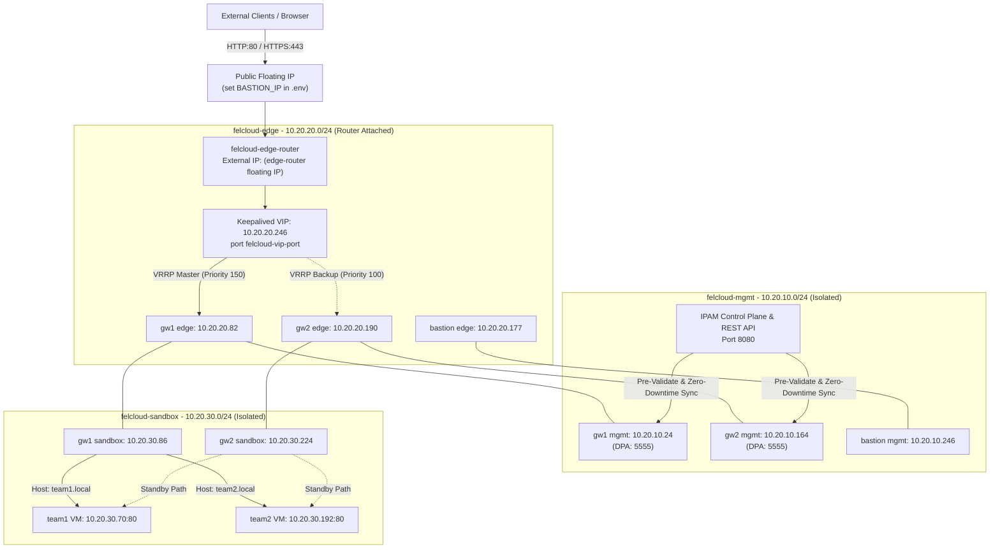
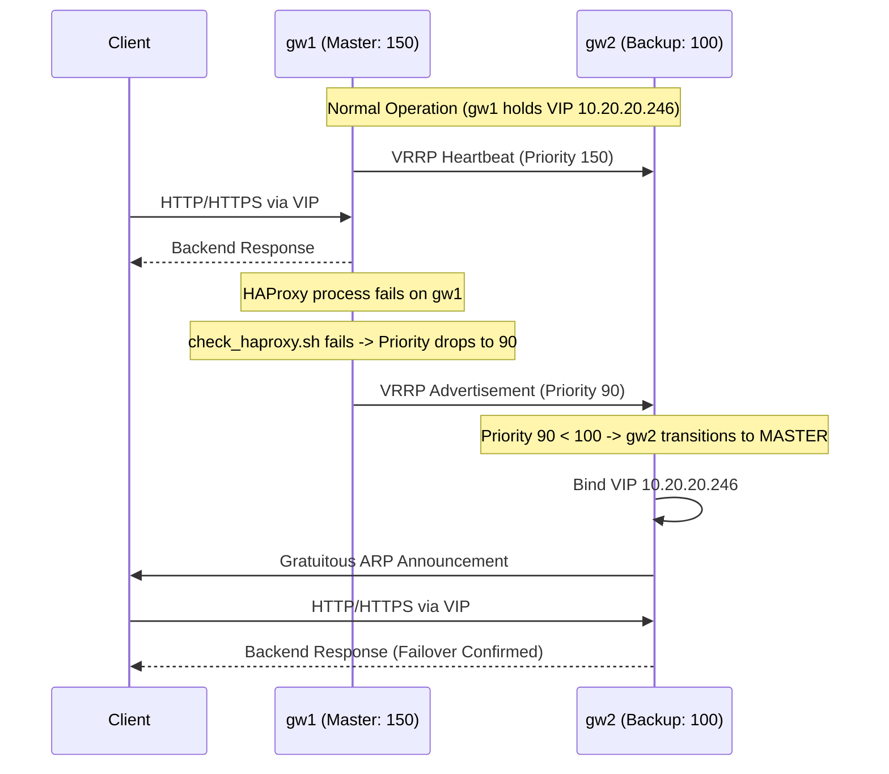
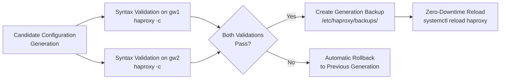

<div align="center">

# FelCloud - Resilient IP Gateway and Multi-Tenant Routing

**High-Availability Edge Gateways, Multi-Tenant L7 Routing, TLS Termination & IPAM Control Plane**

[Features](#phase-1-features) • [Getting Started](#11-prerequisites-and-getting-started) • [Architecture](#2-global-architecture) • [Data Plane API](#6-data-plane-api) • [Testing & Verification](#12-verification-and-testing) • [File Reference](#10-file-reference)


-2C7BB6?style=flat&labelColor=555555)


</div>

> This document describes the actual architecture, implementation details, and verification runbooks of the **FelCloud Resilient IP Gateway** repository.

---

## Table of Contents

1. [Context and Objectives](#1-context-and-objectives)
2. [Global Architecture](#2-global-architecture)
3. [Addressing Plan and Networks](#3-addressing-plan-and-networks)
4. [High Availability & Failover](#4-high-availability)
5. [L7 Routing & TLS with HAProxy](#5-l7-routing-with-haproxy)
6. [Data Plane API](#6-data-plane-api)
7. [Security and Isolation](#7-security-and-isolation)
8. [IPAM Control Plane & Team Lifecycle](#8-ipam-and-team-lifecycle)
9. [Technology Stack](#9-technology-stack)
10. [File Reference](#10-file-reference)
11. [Prerequisites and Getting Started](#11-prerequisites-and-getting-started)
12. [Verification and Testing](#12-verification-and-testing)
13. [Deliverables Checklist](#13-phase-1-deliverables-checklist)
14. [Planned Evolutions](#14-planned-evolutions)
15. [Glossary](#15-glossary)

---

## 1. Context and Objectives

### Overview

The project addresses three key challenges for multi-tenant sandbox platforms on OpenStack:
1. **Public IPv4 scarcity**: Multiplexing traffic for isolated team backends through a shared public entry point.
2. **High availability without single points of failure**: Redundant dual-gateway cluster with active/standby VRRP and guaranteed failover.
3. **Automated, safe lifecycle operations**: Transactional IP allocation, address quarantine, pre-flight backend health checks, and zero-downtime configuration rollouts with automatic rollback protection.

### Key Features

- **Reproducible Infrastructure as Code:** Networks, subnets, routers, security groups, VIP reservation, anti-affinity gateway instances, and jump hosts defined in Pulumi Go ([infra/main.go](infra/main.go)).
- **Guaranteed VRRP Failover:** Keepalived cluster with weight 60 check script ensuring active node priority drops from $150 \rightarrow 90 < 100$, guaranteeing failover on HAProxy process failure ([section 4](#4-high-availability)).
- **Dual HTTP/HTTPS Routing with TLS:** HAProxy terminates TLS on port 443 with wildcard SANs (`*.local`, `*.felcloud.local`) and routes HTTP (port 80) and HTTPS (port 443) by Host header ([section 5](#5-l7-routing-with-haproxy)).
- **HAProxy Data Plane API (DPA):** Deployed and configured on port 5555 with systemd management ([section 6](#6-data-plane-api)).
- **Transactional IPAM with Address Quarantine:** SQLite-backed address allocator with automatic quarantine cooldown and address reclamation ([section 8](#8-ipam-and-team-lifecycle)).
- **Pre-Flight Backend Health Checks:** Validates HTTP/TCP health before opening routes in HAProxy to prevent 502/503 errors.
- **Zero-Downtime Reload with Auto-Rollback:** Dual-gateway syntax pre-validation before reload, generation-aware backups, and automatic rollback to the previous working generation on error.
- **Automated Test Suite:** Benchmarks measured VRRP failover times, verifies IP recycling, and tests end-to-end routing ([section 12](#12-verification-and-testing)).

---

## 2. Global Architecture

### System Topology

Three isolated subnets partition the environment:
- **`felcloud-edge` (`10.20.20.0/24`)**: Public entry, VRRP heartbeat traffic, and Keepalived VIP (`10.20.20.246`).
- **`felcloud-sandbox` (`10.20.30.0/24`)**: Isolated tenant backend network without external routing.
- **`felcloud-mgmt` (`10.20.10.0/24`)**: Control plane, Data Plane API, and Bastion jump host network.



### Request Flow

1. Client sends an HTTP (port 80) or HTTPS (port 443) request with a `Host:` header (e.g., `team1.local` or `team1.felcloud.local`).
2. Traffic reaches the edge router and targets the Virtual IP (`10.20.20.246`), carried actively by the VRRP Master (`gw1`).
3. HAProxy terminates TLS on port 443 (or accepts HTTP on port 80), evaluates Host ACL rules, and matches the backend.
4. HAProxy proxies traffic across the `felcloud-sandbox` network to the team VM on port 80.
5. If no route matches, HAProxy returns a standard 503 Maintenance response.

---

## 3. Addressing Plan and Networks

### Subnets

| Network | CIDR | Purpose | Gateway IP | External Route |
|---|---|---|---|---|
| **`felcloud-edge`** | `10.20.20.0/24` | Ingress VIP, VRRP heartbeat, Public traffic | `10.20.20.1` | Yes (`felcloud-edge-router`) |
| **`felcloud-sandbox`** | `10.20.30.0/24` | Isolated team backends | `10.20.30.1` | No |
| **`felcloud-mgmt`** | `10.20.10.0/24` | Control plane, DPA (5555), SSH jump | `10.20.10.1` | No |

### Assigned Addresses

| Entity | Management (`10.20.10.0/24`) | Edge (`10.20.20.0/24`) | Sandbox (`10.20.30.0/24`) |
|---|---|---|---|
| **`felcloud-gw1`** | `10.20.10.24` | `10.20.20.82` | `10.20.30.86` |
| **`felcloud-gw2`** | `10.20.10.164` | `10.20.20.190` | `10.20.30.224` |
| **`felcloud-bastion`** | `10.20.10.246` | `10.20.20.177` | — |
| **Keepalived VIP** | — | **`10.20.20.246`** | — |
| **`team1`** | — | — | `10.20.30.70` |
| **`team2`** | — | — | `10.20.30.192` |

---

## 4. High Availability

### Dual-Gateway VRRP Architecture

- **Active/Standby Gateway Pair:** `gw1` (Master, priority 150) and `gw2` (Backup, priority 100).
- **Anti-Affinity Placement:** Nova server group with soft anti-affinity ensures gateways reside on distinct hypervisors ([infra/gateway_ports.go](infra/gateway_ports.go)).
- **Neutron Port Security & VIP Binding:** VIP is reserved via an unbound port (`felcloud-vip-port`), authorized on gateway edge ports via `allowed_address_pairs` ([infra/vip.go](infra/vip.go)).

### Guaranteed Failover Mathematics

The Keepalived health script `/usr/local/bin/check_haproxy.sh` monitors HAProxy availability:

$$\text{Weight} = 60$$

- **Normal State:** $\text{Priority}(\text{gw1}) = 150 > \text{Priority}(\text{gw2}) = 100 \implies \text{gw1 is MASTER}$
- **HAProxy Failure on gw1:** $\text{Priority}(\text{gw1}) = 150 - 60 = 90 < 100 \implies \text{gw2 immediately assumes MASTER}$



---

## 5. L7 Routing with HAProxy

- **Dual-Port Listeners:**
  - `frontend http_front`: Listens on `*:80`
  - `frontend https_front`: Listens on `*:443 ssl crt /etc/haproxy/certs/felcloud-gateway.pem alpn h2,http/1.1`
- **Host Header Matching:** Evaluates `hdr(host) -i <team>.local <team>.felcloud.local` and routes to dedicated backends.
- **Health Checks & Timers:** Backends configured with `check inter 2000 rise 2 fall 3`.
- **Default Maintenance:** Returns HTTP 503 Service Unavailable for unmatched hosts.

---

## 6. Data Plane API

HAProxy Data Plane API (DPA) is installed as a systemd service listening on port 5555:
- **Configuration:** `/etc/haproxy/dataplaneapi.yaml` ([ansible/roles/haproxy/templates/dataplaneapi.yaml.j2](ansible/roles/haproxy/templates/dataplaneapi.yaml.j2))
- **Service Unit:** `dataplaneapi.service` ([ansible/roles/haproxy/templates/dataplaneapi.service.j2](ansible/roles/haproxy/templates/dataplaneapi.service.j2))
- **Authentication:** Configured with administrative user credentials.
- **Security Group:** Permitted over `felcloud-mgmt` network via `sg-management` (port 5555).

### Two-Gateway Pre-Validation and Commit Flow



---

## 7. Security and Isolation

### Security Groups Summary

| Security Group | Ingress Rules | Purpose |
|---|---|---|
| **`sg-gateway`** | TCP 80, TCP 443 from `0.0.0.0/0`<br>VRRP (protocol 112) from `10.20.20.0/24` | Ingress web traffic and VRRP heartbeats |
| **`sg-sandbox`** | TCP 80, TCP 8080 strictly from `sg-gateway` | Tenant isolation; **blocks all East-West traffic between sandboxes** |
| **`sg-management`** | TCP 5555 (DPA) and internal mgmt from `10.20.10.0/24`<br>TCP 22 via Bastion | Control plane and SSH access |

---

## 8. IPAM and Team Lifecycle

The IPAM control plane ([ipam/ipam_control.py](ipam/ipam_control.py)) manages IP allocation, address quarantine, pre-flight health checks, and REST API access.

### Address Quarantine & Reclamation

When a sandbox is released:
1. The IP status is set to `QUARANTINED` with a timestamp `quarantine_until` (e.g. 60s cooldown).
2. Immediate allocations strictly bypass quarantined addresses.
3. Upon cooldown expiry, `reclaim_expired_quarantines()` automatically returns the address to `FREE` status.

### Pre-Flight Health Check

Before opening a route in HAProxy:
- Control plane probes `http://<sandbox_ip>:<port>/`.
- Only when health check passes (HTTP 200/2xx) is the route deployed to HAProxy.
- If the probe fails, the route is not opened, preventing gateway 502/503 errors.

### REST API Endpoints (Port 8080)

| Method | Endpoint | Description |
|---|---|---|
| `GET` | `/health` | Health status of control plane |
| `GET` | `/ipam/leases` | List all allocations and quarantine timers |
| `POST` | `/ipam/leases/allocate` | Allocate IP lease (quarantine enforced) |
| `POST` | `/ipam/leases/release` | Release IP into quarantine |
| `POST` | `/ipam/leases/reclaim` | Reclaim expired quarantined IPs |
| `POST` | `/api/sandboxes/provision` | Automated sandbox provisioning & health check |
| `POST` | `/api/gateways/sync` | Zero-downtime dual-gateway sync |
| `POST` | `/api/gateways/rollback` | Rollback to previous configuration generation |

---

## 9. Technology Stack

| Component | Technology | Role |
|---|---|---|
| **Cloud** | OpenStack (Nova, Neutron) on FelCloud | Infrastructure compute and networking |
| **IaC** | Pulumi in Go 1.22 (`pulumi-openstack` v5.1.0) | Infrastructure provisioning |
| **Configuration** | Ansible with Ansible Vault | Gateway configuration and orchestration |
| **High Availability** | Keepalived (VRRP v2, Weight 60) | Virtual IP failover cluster |
| **Reverse Proxy** | HAProxy 2.8+ with TLS & DPA | L7 HTTP/HTTPS reverse proxy & Data Plane API |
| **Control Plane & IPAM** | Python 3, SQLite, HTTP REST API | IP allocations, quarantine, health checks |
| **Testing** | Bash, Python, Curl | Automated test suite & failover benchmarking |

---

## 10. File Reference

```
ip_resilien/
├── README.md                                  # Complete project documentation
├── .env.example                               # Environment variable template
├── ansible/
│   ├── ansible.cfg                            # Ansible execution configuration
│   ├── site.yml                               # Main gateway configuration playbook
│   ├── inventory/
│   │   ├── hosts.yml                          # Gateway cluster inventory
│   │   └── generate_inventory.py              # Inventory generator from Pulumi outputs
│   ├── group_vars/gateways/
│   │   ├── vars.yml                           # Gateway variables & team list
│   │   └── vault.yml                          # Encrypted VRRP secret
│   └── roles/
│       ├── common/tasks/main.yml              # Sysctl tuning, core packages, check script
│       ├── interface_resolve/tasks/main.yml   # Dynamic edge interface detection
│       ├── keepalived/                        # Keepalived tasks, template (weight 60), handler
│       └── haproxy/                           # HAProxy & DPA tasks, TLS certs, templates, handlers
├── output/                                    # Discovery dumps (gitignored, created at runtime)
├── infra/                                     # Pulumi Go Infrastructure as Code
│   ├── main.go                                # IaC stack entry point
│   ├── network.go                             # Subnets & networks
│   ├── router.go                              # Edge router & SNAT gateway
│   ├── security.go                            # Security groups (sg-gateway, sg-sandbox, sg-mgmt)
│   ├── vip.go                                 # Unbound VIP reservation port
│   ├── gateways.go                            # Gateway instances & SSH keypair
│   ├── bastion.go                             # Bastion jump host VM
│   └── sandboxes.go                           # Demonstration team backend VMs
├── ipam/
│   └── ipam_control.py                        # IPAM CLI, quarantine logic, sync & REST API server
└── scripts/
    ├── run-all-tests.sh                       # Master automated test suite runner
    ├── failover-test.sh                       # Measured VRRP failover benchmark
    ├── recycle-test.sh                        # IP quarantine & recycling test
    ├── provision-sandbox.sh                   # Sandbox provisioning & route activation
    └── discover-felcloud.sh                   # OpenStack runtime discovery snapshot
```

---

## 11. Prerequisites and Getting Started

### Prerequisites

- Go 1.22+ and Pulumi CLI
- Ansible with `ansible.posix` collection
- Python 3 with `sqlite3` and `yaml`
- OpenStack credentials configured (e.g. `source openrc.sh`)

### Deployment Steps

1. **Configure Stack:** Update [infra/Pulumi.dev.yaml](infra/Pulumi.dev.yaml) with your OpenStack settings.
2. **Deploy Infrastructure:**
   ```bash
   cd infra && pulumi up
   ```
3. **Configure Gateways:**
   ```bash
   # Run from the repository root (not from ansible/)
   ansible-playbook -i ansible/inventory/hosts.yml ansible/site.yml \
     --vault-password-file ansible/.vault_pass
   ```
4. **Initialize IPAM:**
   ```bash
   python3 ipam/ipam_control.py init
   python3 ipam/ipam_control.py list
   ```
5. **Start Control Plane REST API:**
   ```bash
   python3 ipam/ipam_control.py serve --port 8080
   ```

---

## 12. Verification and Testing

### Run Master Automated Test Suite

```bash
./scripts/run-all-tests.sh
```

**Output:**
```
========================================================================
          FELCLOUD RESILIENT GATEWAY AUTOMATED TEST SUITE               
========================================================================

[TEST 1] IPAM Quarantine & Address Reclamation...
  ✅ PASS: Quarantine cooldown and automatic address reclamation verified

[TEST 2] Pre-flight Sandbox Health Check before Route Activation...
  ✅ PASS: Pre-flight health check correctly accepts healthy backends and blocks dead endpoints

[TEST 3] Syntax Pre-Validation & Automatic Rollback Protection...
  ✅ PASS: Configuration validator correctly flags syntax errors and protects gateway state

[TEST 4] Keepalived VRRP Script Weight Review...
  ✅ PASS: Guaranteed failover confirmed on HAProxy-only failure (150 - 60 = 90 < 100)

[TEST 5] HTTPS 443 TLS & Host Header Routing Template...
  ✅ PASS: HTTPS TLS termination and dual Host-header routing configured

[TEST 6] HAProxy Data Plane API Configuration & Service Units...
  ✅ PASS: Data Plane API templates and systemd units verified

========================================================================
                     AUTOMATED TEST SUMMARY                             
========================================================================
Passed: 6 / 6
✅ ALL AUTOMATED TESTS COMPLETED SUCCESSFULLY!
```

### Run Measured Failover Benchmark

```bash
# Test HAProxy-only failure switchover and packet loss
FAILURE_MODE=haproxy-only VIP_IP=10.20.20.246 TARGET_URL=http://${BASTION_IP} ./scripts/failover-test.sh
```

### Run Address Quarantine Test

```bash
./scripts/recycle-test.sh
```

---

## 13. Phase 1 Deliverables Checklist

| Deliverable | Status |
|---|---|
| Dual-gateway HA cluster (VRRP, weight 60, guaranteed failover) | ✅ Implemented |
| Pulumi Go IaC for all cloud resources | ✅ Implemented |
| Ansible roles for HAProxy, Keepalived, common, interface_resolve | ✅ Implemented |
| Config pre-validation before deploy (`validate:` directive) | ✅ Implemented |
| Rolling deployment (`serial: 1`) | ✅ Implemented |
| TLS termination on port 443 with wildcard SANs | ✅ Implemented |
| Host-header L7 routing per team | ✅ Implemented |
| HAProxy Data Plane API (port 5555) | ✅ Implemented |
| IPAM with address quarantine and reclamation | ✅ Implemented |
| Pre-flight backend health checks | ✅ Implemented |
| Zero-downtime reload with auto-rollback | ✅ Implemented |
| Automated test suite (6 tests) | ✅ Implemented |
| Security: no open-world SSH CIDR, infra entity collision guard | ✅ Implemented |
| Secrets in Ansible Vault only (no plaintext in repo) | ✅ Implemented |

---

## 14. Planned Evolutions

- Integration of PostgreSQL backend for large-scale distributed deployments.
- ACME / Let's Encrypt automated certificate renewals.
- Centralized Prometheus metrics exporter & Grafana telemetry dashboard.

---

## 15. Glossary

| Term | Definition |
|---|---|
| **VIP** | Virtual IP address carried actively by the elected VRRP Master gateway |
| **VRRP** | Virtual Router Redundancy Protocol for active/standby master election |
| **Keepalived** | Daemon implementing VRRP and tracking process health check scripts |
| **HAProxy** | High-performance reverse proxy performing L7 Host-header routing & TLS termination |
| **DPA** | HAProxy Data Plane API for dynamic configuration management |
| **IPAM** | IP Address Management controlling address allocation, quarantine, and reclamation |
| **Quarantine** | State preventing immediate reuse of a released IP until cooldown expires |
| **Allowed Address Pairs** | Neutron mechanism enabling gateway ports to bind the shared VRRP VIP |

---

<div align="center">

*FelCloud Resilient IP Gateway · Built for High-Availability Multi-Tenant Routing.*

</div>
